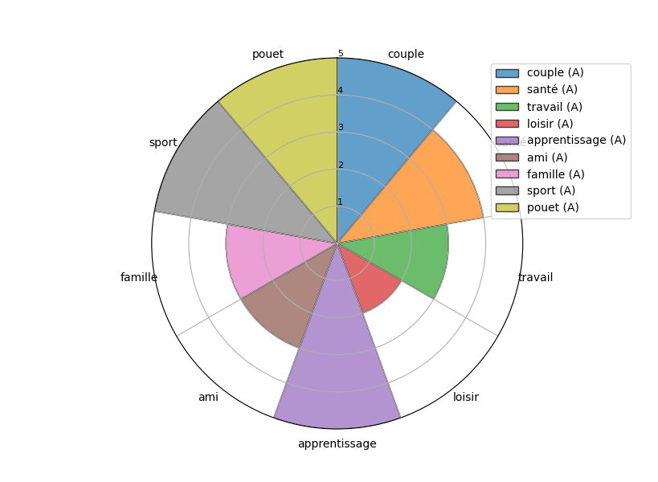

# TITLE

## About
This Python project creates an interactive radar chart based on user input. Users can define different components or shares, providing names and values to visualize their distribution.

## Features
Dynamic Input: Allows the user to input the number of components and their respective values.
Interactive Radar Chart: Generates a radar chart based on user input, showcasing the distribution of values among different components.

## Usage
Number of Components: Enter the number of components.
Input Values: Provide names and values for each component.
Visual Representation: View an interactive radar chart illustrating the distribution of values among different components.

## Context - 
NaN

## Skills
Python Fundamentals
Data Visualization with Matplotlib and Pandas
User Input Handling

## Credits
[Tuxiboule](https://github.com/Tuxiboule)
